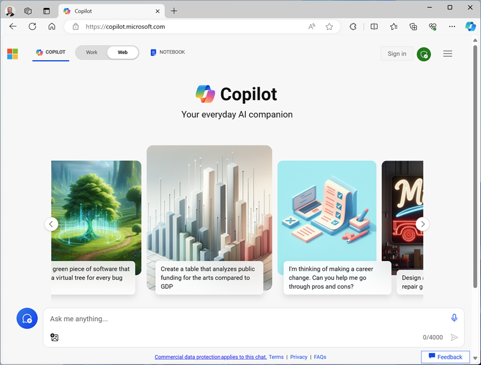

---
lab:
  title: Titolo esercizio
  module: Learn module title
---
<!--
Edit the metadata above to manage the list of exercises in the home page of the GitHub site that gets generated.
You can delete the module and edit index.md in the root of the repo to customize the display so that only the exercises are listed
To enable GitHub page publishing, edit the Page settings for the repo and publish from the main branch
-->

# Titolo esercizio <!-- match title in metadata above (and Learn Exercise unit and ILT slide)-->

In questo esercizio si eseguiranno le seguenti operazioni: <!-- provide a description of what they'll do and why it;s important -->

Il completamento di questo esercizio richiede circa **15** minuti. <!-- update with estimated duration -->

## Prima di iniziare

<!--
Add steps to get the learner to the starting point" for the exercise.
This might be cloning the repo and running a script or performing some manual steps.
Only include this section if its necessary to do some pre-exercise setup AND the same setup steps are required for self-paced (on Learn) and managed (in hosted ILT lab profiles) scenarios. Otherwise delete this section.
If self-paced /ILT-specific setup steps are required, include them in the Learn "Exercise" unit from where they open this exercise and in the Skillable lab profile instructions before this markdown file is imported.
 -->

Prima di iniziare questo esercizio, è necessario...

1. Passaggio 1
1. Step 2
1. E così via.

## Attività <!-- Change to an appropriate task title with an imperative verb phrase (e.g. "Do something") -->

Prima di tutto, è necessario ...

1. Passaggio 1
1. Questo passaggio include un esempio di `inline code formatting`, che viene usato quando lo learner deve digitare qualcosa (niente, non solo codice) perché crea un collegamento [T] nell'ambiente skillable ospitato.
1. Se è necessario che lo strumento di apprendimento apra un sito Web, includere entrambi i collegamenti (in modo che possano essere aperti facendo clic nella pagina Html GitHub) E l'URL formattato come codice (in modo che possano digitarlo in un browser di macchine virtuali ospitate). Ad esempio, "Aprire il sito Web Bing[ all'indirizzo ".](https://www.bing.com)`https://www.bing.com`
1. Se è necessario lo learner per scaricare un file (o un gruppo di file in un file ZIP), archiviare il file nella cartella Allfiles in questo repository e usare l'URL non elaborato **, come illustrato di seguito: "Scaricare [il **nome](https://raw.githubusercontent.com/MicrosoftLearning/INF99X-SampleCourse/master/Allfiles/Labs/01/Starter/azuredeploy.json) file da `https://raw.githubusercontent.com/MicrosoftLearning/INF99X-SampleCourse/master/Allfiles/Labs/01/Starter/azuredeploy.json`.
1. In alternativa, per un pubblico di sviluppatori, è possibile clonare questo repository se questo sembra più appropriato.
1. Se è necessario includere un blocco di codice su più righe, impostare un rientro corrispondente al rientro elenco puntato:

    ```python
    # This is an example of an
    # indented code block.
    ```

1. Se è necessario includere un elemento acreenshot, ridimensionarlo in base a una dimensione appropriata (in modo che qualsiasi testo formattato "normale" in uno screenshot parziale sia approssimativamente la stessa dimensione di questo testo, in genere provare a creare screenshot delle finestre dell'applicazione complete 800x600px (circa)). Archiviare le immagini in una **sottocartella Media** e usare markdown per aggiungerlo alla pagina (ricordare che i nomi di file e cartelle fanno distinzione tra maiuscole e minuscole). Se l'immagine si trova in un elenco, impostare un rientro simile al seguente:

     

1. Se è necessario spiegare il motivo per cui si esegue un'operazione o fornire ulteriori informazioni di contesto o collegamenti, usare una nota simile alla seguente:

    > **Nota**: si tratta di una nota.

1. Essere flessibili quando si forniscono istruzioni che possono variare tra ambienti lab auto-gestiti e ospitati. Ad esempio:
    - "Accedere usando le credenziali di Azure" (presupponendo che siano state fornite istruzioni specifiche di Learn per usare una sottoscrizione personale o creare una versione di valutazione nella pagina dell'esercizio di Learn e istruzioni specifiche di ILT per usare le credenziali cloudslice fornite nel profilo del lab skillable)
    - "Selezionare un gruppo di risorse esistente o crearne uno nuovo" (presupponendo che se si usa un cloudslice CS-R con competenza, è stata inclusa una nota nel profilo del lab che indica all'utente il gruppo di risorse da usare)
    <!-- The key point is that this markdown file should be environment-agnostic - you need to provide explicit details of things that can vary OUTSIDE of this file (in the Learn exercise page or the Skillable lab profile instructions) -->
1. E così via.

## Attività successiva

Ora andiamo, ...

1. Passaggio 1
1. Step 2
1. E così via.

## Attività con sottoattività

A volte si potrebbe voler suddividere un taak giù in blocchi più piccoli.

### Sottoattività 1

1. Passaggio 1
1. Step 2
1. Altro.

### Sottoattività 2

1. Passaggio 1
1. Step 2
1. E così via.

## Eseguire la pulizia

<!-- Good practice - especially as self-paced learners will be using their own subscriptions -->
<!-- Delete this section if it is not needed -->

Dopo aver completato l'esercizio, è necessario eliminare le risorse cloud create per evitare l'utilizzo delle risorse non necessarie.

1. Passaggio 1
2. E così via.
